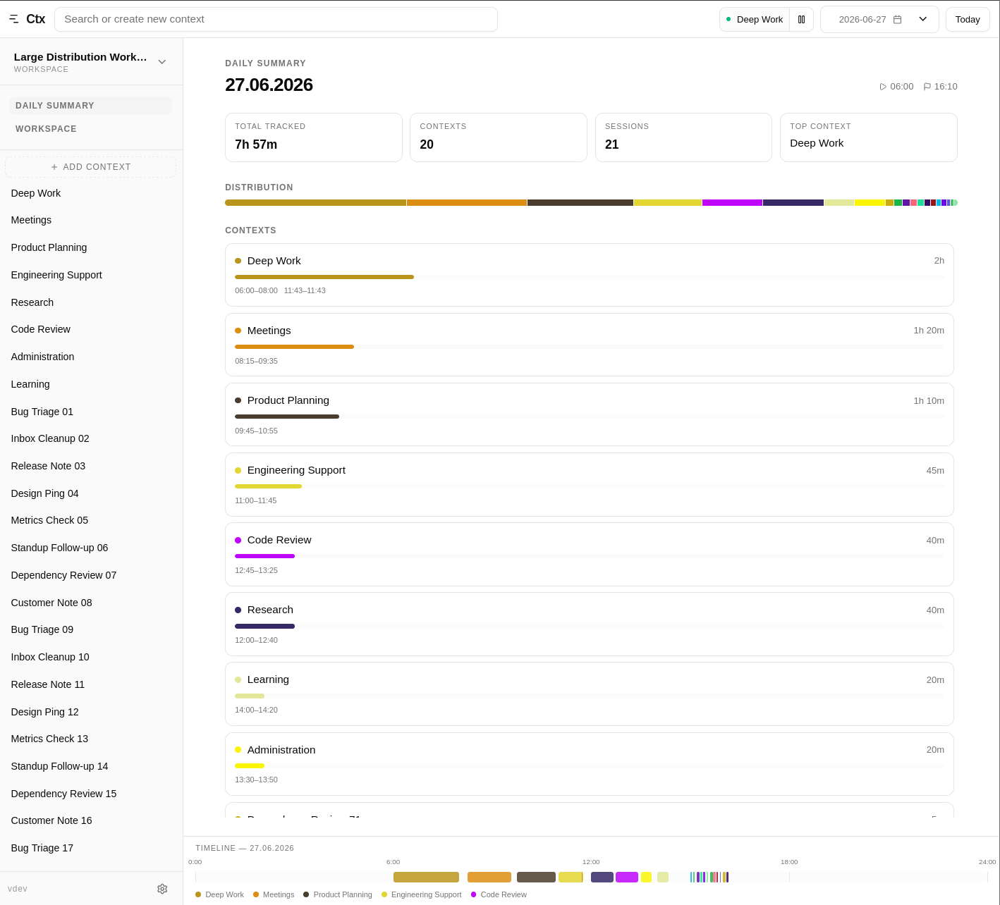
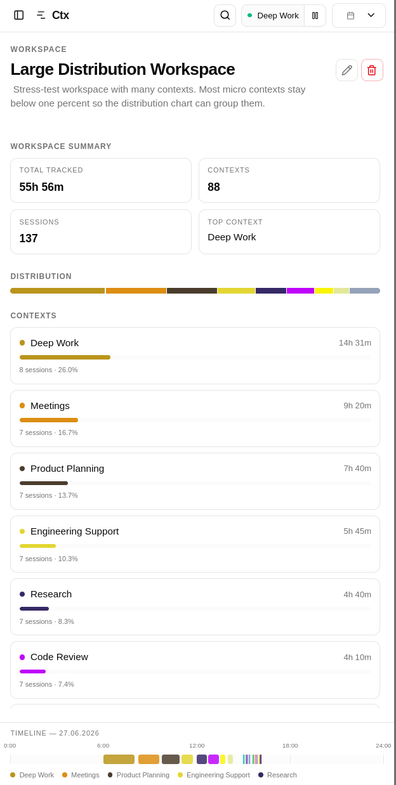

# ctx

A lightweight time tracker: CLI + Go server + optional Angular web UI. It works in local mode (SQLite), remote mode (remote API), and all-in-one mode with embedded SPA assets.




## 1) CLI usage examples

### Simple local usage

```bash
ctx create context --name "Work"
ctx switch --name "Work"
ctx create interval --context-id <CONTEXT_ID>
ctx list context
ctx summary day --day 2026-04-12
```

### Remote usage

```bash
ctx --remote http://localhost:8080 list context
ctx --remote http://localhost:8080 create context --name "Client A"
ctx --remote http://localhost:8080 free
```

### Remote behind reverse proxy with `/api` prefix

```bash
ctx --remote https://ctx.example.com/api list context
```

## 2) Available modes

- **CLI local** — commands read/write directly to local SQLite.
- **CLI remote** — commands send requests to a server (`--remote` or `remote` in config).
- **Backend + separate UI** — `ctx serve` as API + UI started separately from `ui/`.
- **All-in-one (`allinone`)** — `ctx serve` also serves embedded SPA assets (no nginx).

## 3) Configuration

The app reads configuration from `~/.ctx.yaml` and environment variables.

Example:

```yaml
remote: http://localhost:8080
log_level: info
database:
  path: ctx.db
```

Key rules:

- `--remote` has higher priority than `remote` from config.
- If neither `--remote` nor `remote` is set, CLI runs in local mode.
- `remote` may include a path prefix (e.g. `https://host/api`).

Environment variables:

| Variable        | Config key      | Default  | Description                                        |
| --------------- | --------------- | -------- | -------------------------------------------------- |
| `REMOTE`        | `remote`        | empty    | Remote server base URL used by CLI in remote mode. |
| `LOG_LEVEL`     | `log_level`     | `info`   | Logger level (`debug`, `info`, `warn`, `error`).   |
| `DATABASE_PATH` | `database.path` | `ctx.db` | SQLite database file path.                         |

Global flags:

- `--remote, -r`
- `--output, -o` (`text|json|yaml|shell`)
- `--config`
- `--verbose, -v`

## 4) Technology stack

- **Backend/CLI:** Go 1.25+, Cobra, Viper, SQLite
- **UI:** Angular 21, TypeScript, Tailwind
- **Containers:** Docker (separate images + all-in-one)
- **CI/CD:** GitHub Actions, GoReleaser

## 5) Run and build instructions

### Requirements

- Go 1.25+
- Node.js 22+ (for UI)
- npm

### Clone

```bash
git clone <REPO_URL>
cd ctx
```

Note: the `ui/` directory is included in this repository and is no longer a git submodule; no submodule init step is required.

### Build CLI/server

```bash
go build -o ctx .
```

### Run backend only

```bash
ctx serve --addr :8080
```

### Run backend + separate UI (dev)

Terminal 1:

```bash
ctx serve --addr :8080
```

Terminal 2:

```bash
cd ui
npm install
npm run start
```

UI: `http://localhost:4200`

### Run all-in-one (embedded SPA)

```bash
cd ui
npm install
npm run build -- --configuration production
cd ..
sh ./scripts/prepare-spa-assets.sh
go run -tags allinone . serve --addr :8080
```

UI: `http://localhost:8080`

### Docker

Server:

```bash
docker build -t ctx:latest .
docker run --rm -p 8080:8080 -v $(pwd)/data:/data ctx:latest
```

All-in-one:

```bash
docker build -f Dockerfile.all-in-one -t ctx:all-in-one .
docker run --rm -p 8080:8080 -v $(pwd)/data:/data ctx:all-in-one
```

## License

This project is licensed under `Apache-2.0`.
