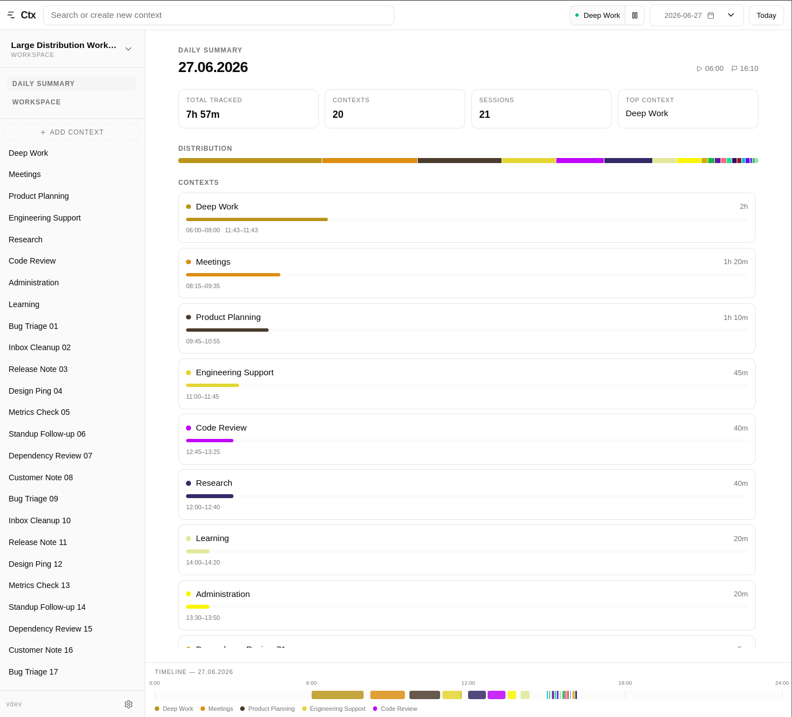
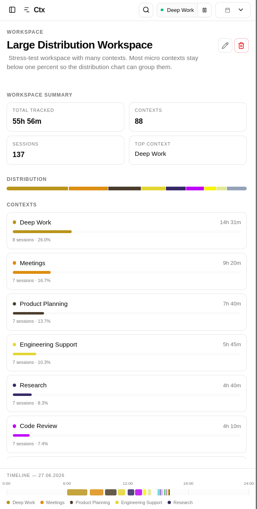

# ctx

A lightweight time tracker with a CLI, Go server, and optional Angular web UI. It can work directly with a local SQLite database, connect the CLI to a remote server, or run as a single binary with the web UI embedded.

<p align="center">
  
  
</p>

## Features

- **Context-based time tracking** — start or switch contexts, stop the active context, and add, edit, move, or delete time intervals.
- **Workspaces** — create, select, rename, and delete workspaces that keep contexts and their statistics separate.
- **Daily and workspace summaries** — inspect tracked time, session counts, time distribution, first and last session times, top contexts, and a day timeline.
- **Fast search and creation** — search contexts in the selected workspace, see time badges for the selected day and all time, or create and start a context directly from the search box.
- **Context details** — manage a context's name, description, tags, intervals, and today/all-time statistics.
- **Context archiving** — archived contexts are read-only and hidden from regular context lists, but remain available in search and historical summaries. They can be restored or permanently deleted.
- **Per-workspace link rules** — turn matching parts of context names, such as Jira or GitHub issue keys, into links using regular expressions and capture-group templates.
- **Application settings** — select a light or dark theme and choose Monday or Sunday as the first day of the week.
- **Data integrity tools** — inspect workspaces, contexts, and intervals for broken references or invalid state, then automatically repair supported issues.
- **Local and remote CLI** — use the same resource commands against a local database or a remote HTTP API.
- **Structured output** — render CLI results as `text`, `json`, `yaml`, or shell variables.

## Quick start

### CLI

Contexts belong to a workspace. Create or list a workspace first, then pass its ID to workspace-scoped commands:

```bash
ctx create workspace --name "Work"
ctx list workspace

ctx create context --name "Client A" --workspace <WORKSPACE_ID>
ctx list context --workspace <WORKSPACE_ID>

ctx switch --id <CONTEXT_ID>
ctx free

ctx summary day --workspace <WORKSPACE_ID> --day 2026-04-12
```

Switching starts a new interval and finishes the previously active one. You can also switch by name when the workspace is explicit:

```bash
ctx switch --name "Client A" --workspace <WORKSPACE_ID>
```

Intervals can be entered or corrected manually:

```bash
ctx create interval \
  --context-id <CONTEXT_ID> \
  --start "2026-04-12 09:00:00" \
  --end "2026-04-12 10:30:00"

ctx edit interval \
  --id <INTERVAL_ID> \
  --start "2026-04-12 09:15:00" \
  --end "2026-04-12 10:30:00"
```

Archive and restore contexts without losing their history:

```bash
ctx archive context --id <CONTEXT_ID>
ctx restore context --id <CONTEXT_ID>
```

### Remote CLI

Add `--remote` to run the same commands against a server:

```bash
ctx --remote http://localhost:8080 list workspace
ctx --remote http://localhost:8080 list context --workspace <WORKSPACE_ID>
ctx --remote http://localhost:8080 switch --id <CONTEXT_ID>
ctx --remote http://localhost:8080 free
```

A reverse-proxy path prefix is supported:

```bash
ctx --remote https://ctx.example.com/api list workspace
```

### CLI command overview

| Area                   | Commands                                                                                                                                    |
| ---------------------- | ------------------------------------------------------------------------------------------------------------------------------------------- |
| Workspaces             | `create workspace`, `list workspace`, `edit workspace`, `delete workspace`                                                                  |
| Contexts               | `create context`, `list context`, `edit context`, `switch`, `free`, `archive context`, `restore context`, `delete context`, `merge context` |
| Intervals              | `create interval`, `list interval`, `edit interval`, `delete interval`                                                                      |
| Reports                | `summary day`                                                                                                                               |
| Server and diagnostics | `serve`, `version`, `remote request`                                                                                                        |

Run `ctx <command> --help` for all flags. Useful examples include:

- `--workspace, -w` when creating or listing contexts, listing intervals, showing daily summaries, or switching by name
- `--day` in `YYYY-MM-DD` format; the default is today
- `--verbose, -v` to include detailed context and interval data
- `--output, -o` with `text`, `json`, `yaml`, or `shell`

## Available modes

- **CLI local** — commands read and write the local SQLite database directly.
- **CLI remote** — commands send requests to a server selected with `--remote` or the `remote` config key.
- **Backend with a separate UI** — `ctx serve` runs the API while the Angular app is served separately from `ui/`.
- **All-in-one** — a binary built with the `allinone` tag serves both the API and embedded SPA assets, without nginx.

The server exposes the API under `/api` and also keeps the root-level routes used by existing clients.

## Configuration

The app reads configuration from `~/.ctx.yaml` and environment variables.

Example:

```yaml
remote: http://localhost:8080
log_level: info
database:
  path: ctx.db
```

Key rules:

- `--remote` has higher priority than `remote` from the config file.
- If neither `--remote` nor `remote` is set, the CLI runs in local mode.
- `remote` may include a path prefix, for example `https://host/api`.

Environment variables:

| Variable        | Config key      | Default  | Description                                        |
| --------------- | --------------- | -------- | -------------------------------------------------- |
| `REMOTE`        | `remote`        | empty    | Remote server base URL used by the CLI.            |
| `LOG_LEVEL`     | `log_level`     | `info`   | Logger level: `debug`, `info`, `warn`, or `error`. |
| `DATABASE_PATH` | `database.path` | `ctx.db` | SQLite database file path.                         |

Global flags:

- `--remote, -r`
- `--output, -o`
- `--config`
- `--verbose, -v`

### Upgrading an existing database

Database migrations run automatically at startup. When upgrading a database created before workspaces were introduced, ctx creates a default workspace and assigns existing contexts and intervals to it. After upgrading, open **Settings → Data integrity** in the web UI to verify the migrated data and repair any remaining supported issues.

Back up the SQLite file before upgrading between releases.

## Run and build

### Requirements

- Go 1.26.3
- Node.js 22+ and npm 10+ for the web UI

### Clone

```bash
git clone https://github.com/m87/ctx.git
cd ctx
```

The `ui/` directory is part of this repository and is not a git submodule.

### Build the CLI and server

```bash
go build -o ctx .
./ctx version
```

### Run the backend only

```bash
./ctx serve --addr :8080
```

### Run the backend and UI in development

Terminal 1:

```bash
./ctx serve --addr :8080
```

Terminal 2:

```bash
cd ui
npm install
npm run start
```

Open `http://localhost:4200`.

### Run all-in-one

```bash
cd ui
npm install
npm run build -- --configuration production
cd ..
sh ./scripts/prepare-spa-assets.sh
go run -tags allinone . serve --addr :8080
```

Open `http://localhost:8080`.

### Docker

Backend only:

```bash
docker build -t ctx:latest .
docker run --rm -p 8080:8080 -v "$(pwd)/data:/data" ctx:latest
```

Backend with the embedded web UI:

```bash
docker build -f Dockerfile.all-in-one -t ctx:all-in-one .
docker run --rm -p 8080:8080 -v "$(pwd)/data:/data" ctx:all-in-one
```

The database is stored in `./data/ctx.db` in both examples.

## Technology stack

- **Backend and CLI:** Go 1.26.3, Cobra, Viper, GORM, SQLite
- **UI:** Angular 21, TypeScript 5.9, Tailwind CSS 4
- **Containers:** Docker, with separate backend-only and all-in-one images
- **CI/CD:** GitHub Actions and GoReleaser

## Changelog

See [CHANGELOG.md](CHANGELOG.md) for release notes and upgrade details.

## License

This project is licensed under the [Apache License 2.0](LICENSE).
